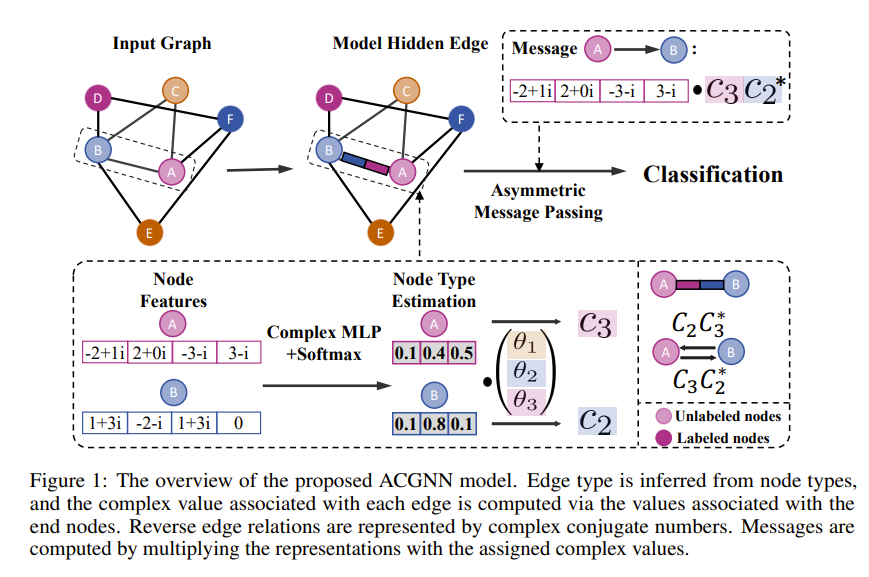

# ACGNN: Exploring the Potential of Complex-Valued Graph Neural Networks in Modeling Hidden Edge Relations

[](https://pytorch.org/get-started/locally/)
[](https://pytorch-geometric.readthedocs.io/en/latest/install/installation.html)

This is the official implementation of the paper "Exploring the Potential of Complex-Valued Graph Neural Networks in Modeling Hidden Edge Relations".



## Environment
This original code is tested on the following environment:
```
docker run -it --gpus all kom4cro/cuda11.7-pytorch1.13-mamba1.1.1:1.1.1 /bin/bash
```

Using Conda/[Mamba](https://github.com/conda-forge/miniforge) to create a new environment:
```
mamba env create -f config_files/env.yaml
mamba activate complex
```
Here is some additional hardware information: We use a single NVIDIA A100 GPU with 80GB memory and AMD EPYC 7V13 64-Core Processor CPU.

## Run

Example:
```
python train.py --dataset chameleon --adj_norm row --separate_loss true
```
+ `--dataset`: the dataset to use
+ `--adj_norm`: the normalization method for the adjacency matrix
+ `--separate_loss`: whether to use separate loss for each layer
+ `--lr`: learning rate
+ `--weight_decay`: weight decay
+ `--dropout`: dropout rate

More parameters can be found and modified in the `config.py` file, such as hidden dimension, number of layers, etc, for further customization.

## Reproduce
All hyperparameters are listed in the `config_files/hyper.yaml` file. For easy reproduction, you can use the bash script `run_all.sh` to run all the experiments, where hyperparameters are passed as command line arguments. 
```
bash run_all.sh
```
## Hyperparameters Search
There is also a optional function for hyperparameters search. You can use the following command to run the hyperparameters search:
```
python train.py <--any other arguments> --search_hyper_mode true --sweep_project_name 'your project name'
```
The hyperparameters search space is defined in the `train.py` file. You can modify the search space for your own experiments, from Line 171 to Line 200. Default, learning rate, weight decay and dropout rate are searched.
## Graph Statistics
As we mentioned in the paper, we also provide the graph statistics for the datasets we used. Run the following command to get the statistics:
```
python get_homo_score.py
```